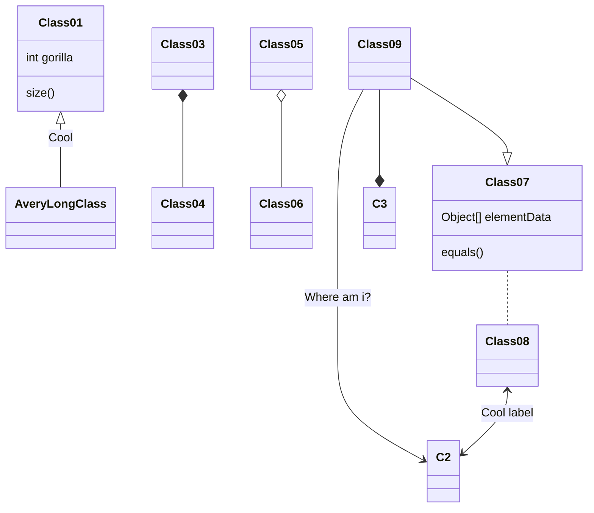

- observer pipe
  - mergeMap
  - concatMap

- @ques 如何测试..

  - 在浏览器中直接运行
  - describe assert beforeAll beforeEach after...
  - 可以执行某个文件夹的所有测试 可以执行全部测试
  - 直接在 console 中输出结果...
  - 异步函数...
  - api 简单明了
  - coverage
  - 浏览器中直接展示 ui...

* @ques 本地 ui 的测试..

  - 启动 test 页面
  - 直接 dynamic import

- prettier markdown config
